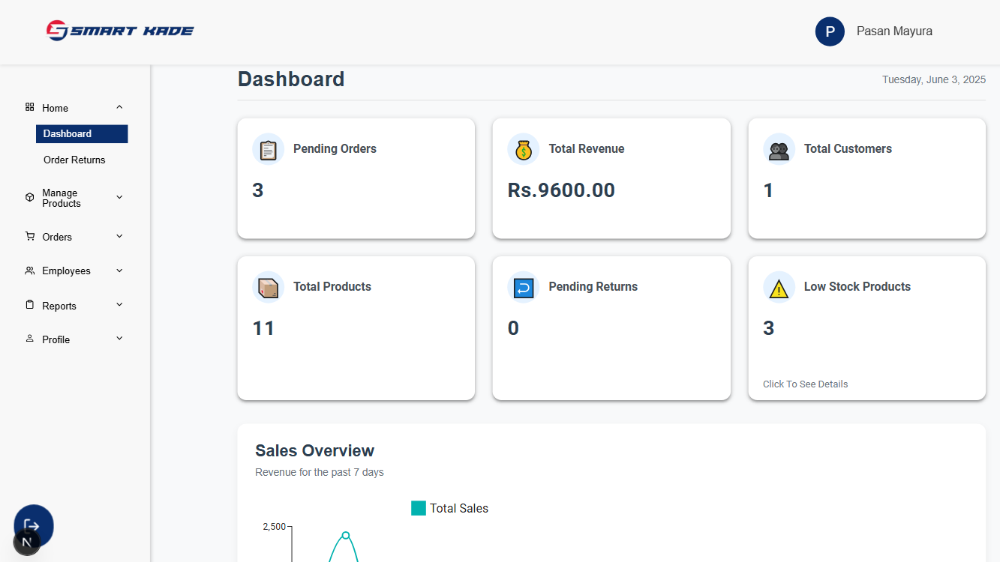
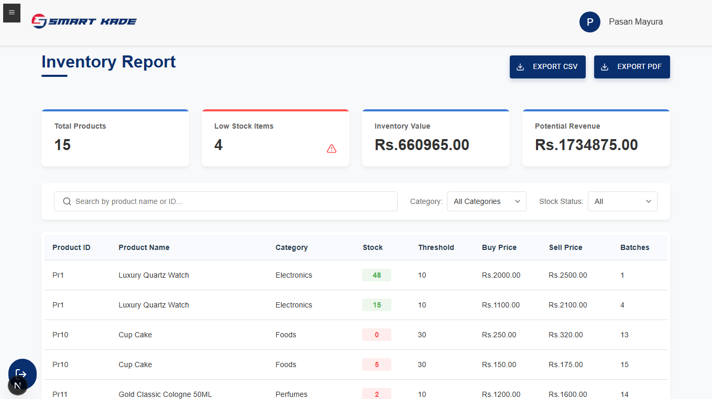
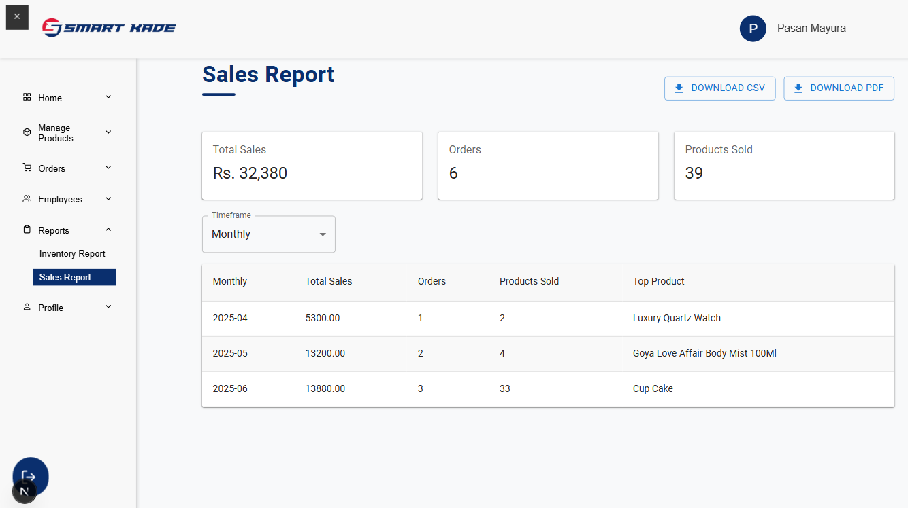
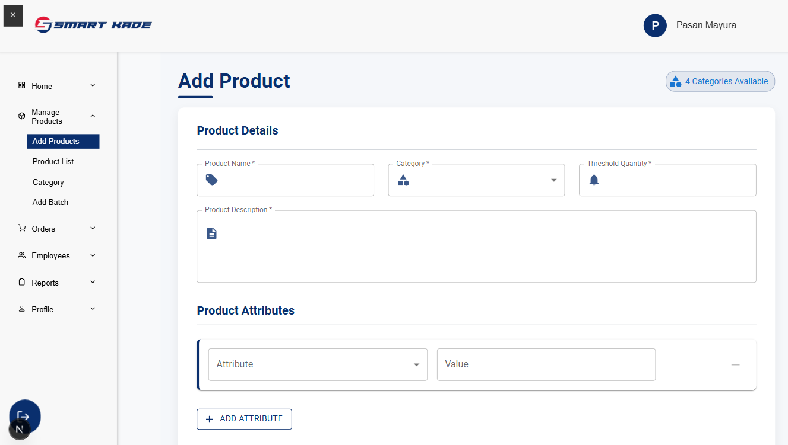
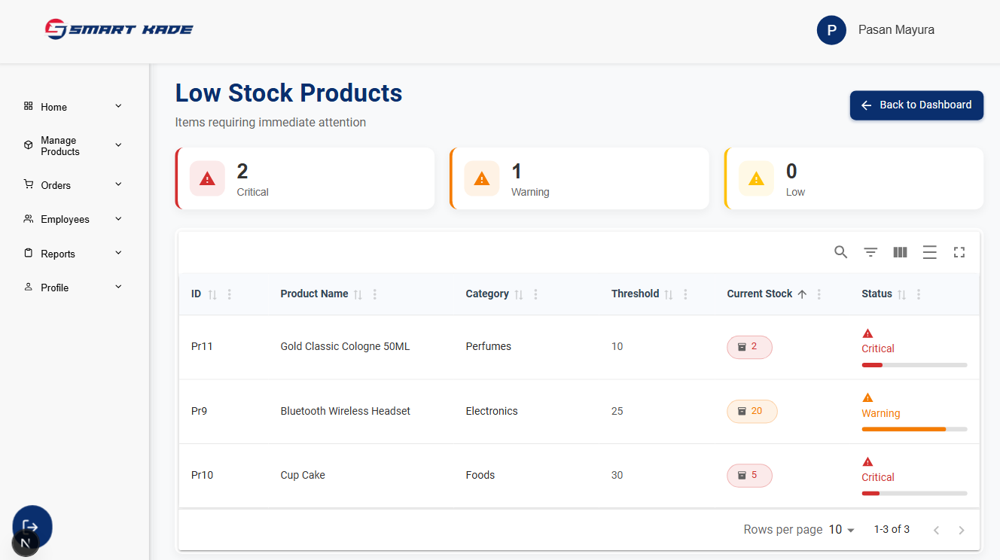
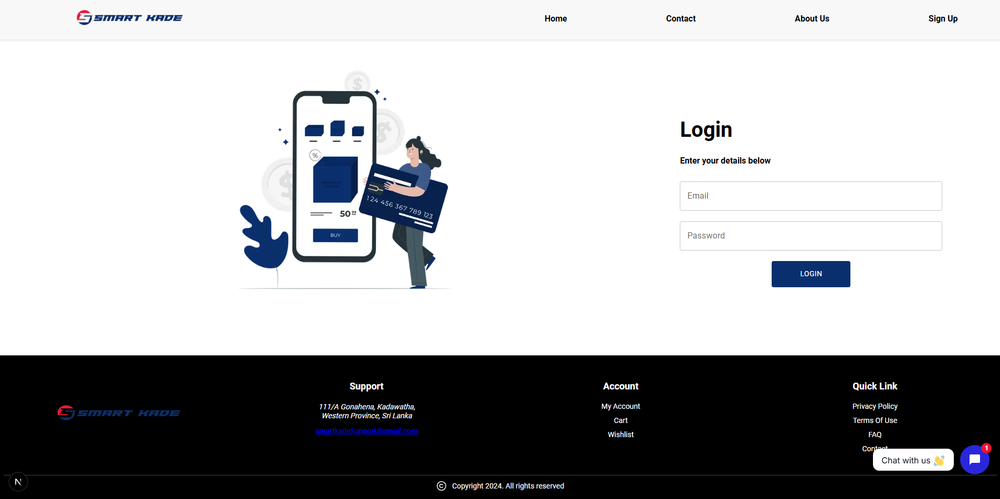
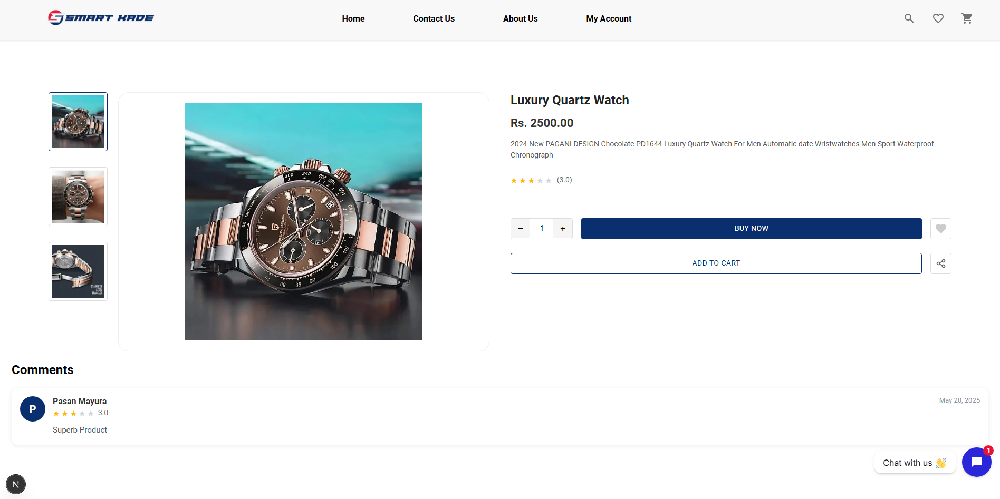
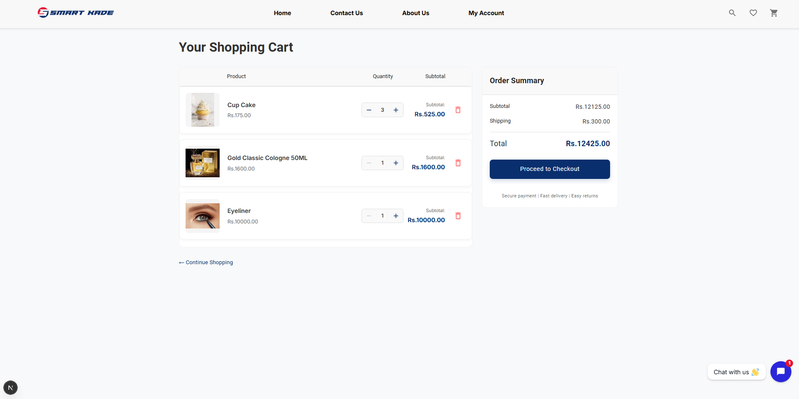
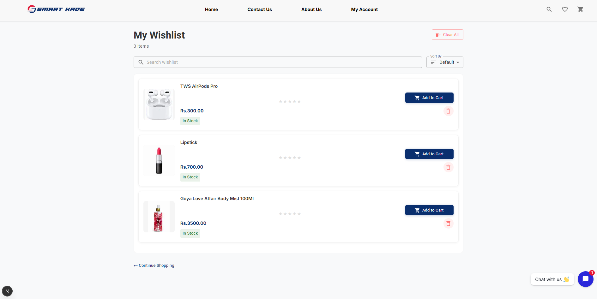
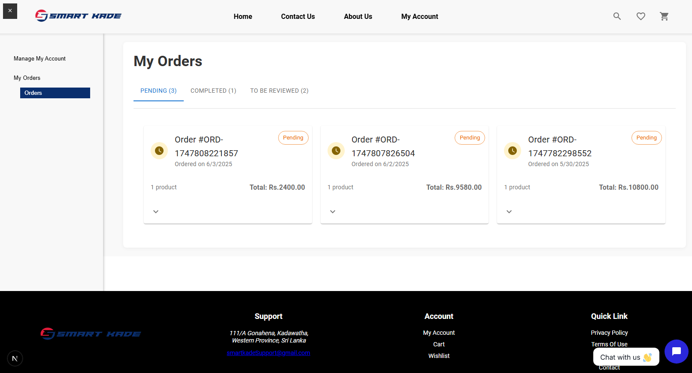

# 🛍 SMART KADE – E-commerce System

SMART KADE is a user-friendly e-commerce system where customers can buy products online, and admins can manage the store.  
Built using the **MERN stack** (React, Express, Node.js) with **MySQL** as the database.

---

## 📁 Project Structure

```
smart-kade-ecommerce/
│
├── backend/              # Admin backend (Express + MySQL)
├── backend-customer/     # Customer backend (Express + MySQL)
├── frontend-admin/       # Admin panel (React)
├── frontend-customer/    # Customer website (React)
├── README.md             # Project documentation
└── package.json
```

---

## 🧠 Code Quality & Architecture

We follow best practices to keep the code clean, simple, and scalable:

- 📌 **MVC Structure**  
  ➤ Models, Controllers, Routes separated

- 📦 **Modular Folder Setup**  
  ➤ Easy to understand and maintain

- 🔁 **Reusable Code**  
  ➤ Reusable components and API services

- 🤩 **Frontend Logic**  
  ➤ Context API & custom hooks for clean state management

- 🔐 **Backend Security**  
  ➤ JWT Auth, environment config with `.env`, error handling

---

## ⚙️ Technologies Used

- **Frontend:** React.js, JavaScript
- **Backend:** Node.js, Express
- **Database:** MySQL
- **Others:** JWT Auth, REST API, MVC Pattern

---

## 🚀 Features

### ✅ Customer Side

- 🛍️ **Browse & Search Products**  
  ➤ Easy product filtering by category or keyword

- 🤖 **ChatBot**  
➤ Chatbot helps customers with product info, FAQs, and support.

- 🛒 **Shopping Cart System**  
  ➤ Add/remove items with total price update

- 💳 **Checkout with Stripe Payment**  
  ➤ Secure and smooth payment process

- 👤 **Customer Account**  
  ➤ Register, login, view order history

- 📦 **Order Tracking**  
  ➤ See order status (e.g., pending, shipped)

- 📱 **Mobile Responsive Design**  
  ➤ Looks great on phones and tablets

---

### ✅ Admin Side

- 📊 **Admin Dashboard**  
  ➤ View total sales, users, and order counts

- 📟 **Product Management**  
  ➤ Add, update, or delete products with images

- 📦 **Order Management**  
  ➤ Mark orders as processed, shipped, or delivered

- 👥 **Customer Management**  
  ➤ View registered users, contact details

- 📈 **Sales Reporting**  
  ➤ Basic reports with revenue and product stats

- 🔐 **Secure Admin Login**  
  ➤ Only authorized admins can access dashboard

---

### ✅ Common Features (Both sides)

- 🔐 **JWT Authentication**  
  ➤ Secure token-based login system

- 📬 **Email or SMS Notification (Optional)**  
  ➤ For order confirmation (if integrated)

- 🌐 **RESTful APIs**  
  ➤ Clean API structure for frontend-backend communication

- 🧪 **Form Validation**  
  ➤ Ensures users enter valid details

- 📂 **Environment-Based Configuration**  
  ➤ `.env` support for database and API keys

---

## 👤 Owner Info

- 🧑‍💻 Works at **Dialog**  
- 🛍️ Runs **SMART KADE** part-time  
- 🏡 Lives in **Gonahena, Kadawatha**

---

## 📸 Screenshots
## Admin Side






## Customer Side







## Mobile View


---

## 🔽️ How to Clone and Run the Project

### 🧰 Step-by-Step Setup

1. 📂 **Clone the repository**
   ```bash
   git clone https://github.com/pasanmayura/Ecommerce_Website.git
   cd Ecommerce_Website
   ```

2. ⚙️ **Set up MySQL database**
   - Create a database (e.g., `smartkade_db`)
   - Import schema if available
   - Add your DB credentials in each `.env` file

3. 🧪 **Install and Run Each App**

#### 📦 Backend – Admin
```bash
cd backend
npm install
npm run dev
```

#### 📦 Backend – Customer
```bash
cd backend-customer
npm install
npm run dev
```

#### 🔠 Frontend – Customer
```bash
cd frontend-customer
npm install
npm start
```

#### 🔠 Frontend – Admin
```bash
cd frontend-admin
npm install
npm start
```

> ✅ Make sure all `.env` files are properly set in each backend folder!

---